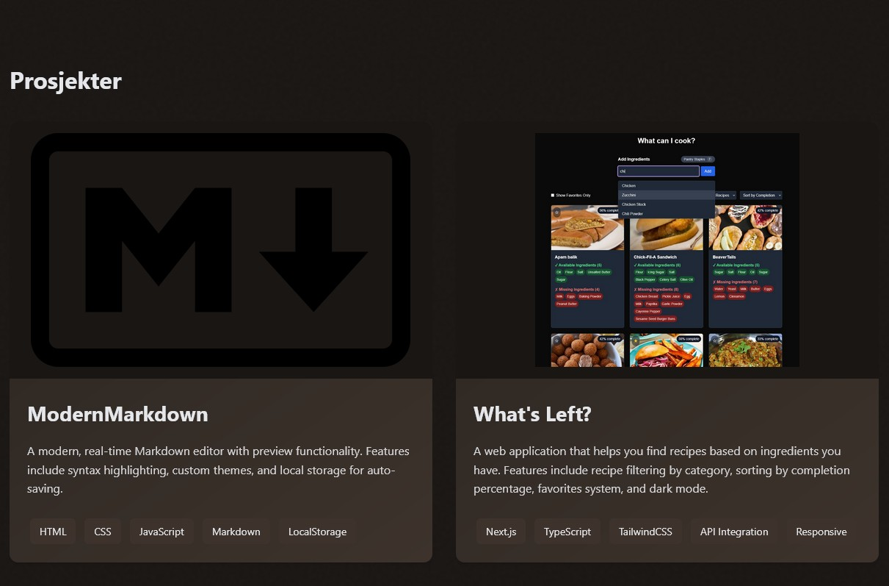

# Stefan Bekkevold - Portfolio

A modern portfolio website showcasing technical skills, projects, and professional experience. Built with pure web technologies and a focus on performance.

**Live Demo:** [https://folence.github.io/portfolio](https://folence.github.io/portfolio)

## Features

- 🎨 Custom wood-inspired color scheme with dark/light mode toggle
- 🚀 Vanilla JavaScript implementation (no frameworks)
- 📱 Fully responsive design
- ✨ Smooth scroll animations and transitions
- 📂 Project showcase with live demos
- 📄 Professional experience timeline
- 📬 Contact section with multiple channels
- ⚡ Optimized performance (95+ Lighthouse score)

## Technologies Used

- **Frontend:**
  - HTML5
  - CSS3 (Custom Properties, Grid, Flexbox)
  - Vanilla JavaScript
  - CSS Animations
  - Intersection Observer API

- **Tools:**
  - GitHub Pages (Hosting)
  - Prettier (Code formatting)
  - Lighthouse (Performance auditing)

## Key Components

- Theme switching system
- Responsive navigation
- Project cards with hover effects
- Experience timeline
- Contact form alternatives
- Dynamic content loading
- Progressive enhancement
- Accessibility features
